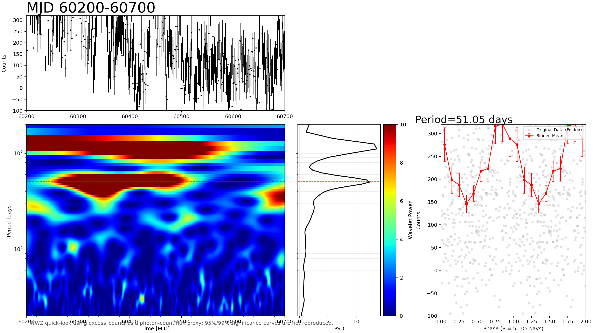
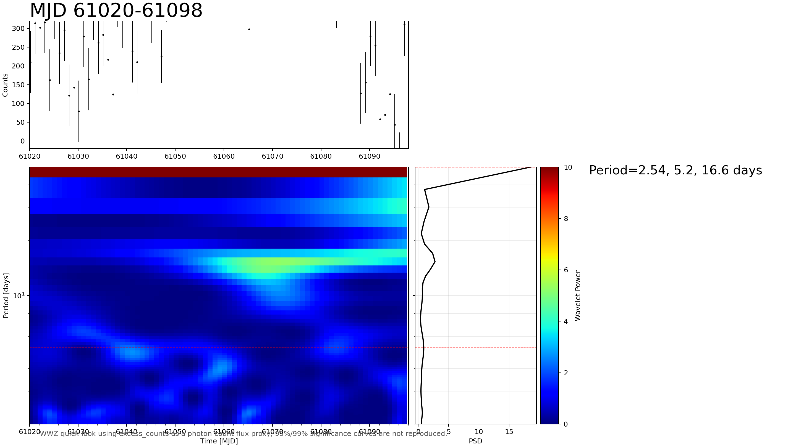

# Mrk 421 / Mrk 501 WCDA Periodicity Analysis v1

Published on GitHub Pages. Report date: 2026-05-21.

This report keeps the existing Mrk 421 WCDA/Fermi quick-look periodicity analysis, adds the newly generated Mrk 501 LHAASO-WCDA weekly light curve, and includes an xgm-poster-style Mrk 421 daily WWZ reproduction check. It runs CWT and WWZ checks and intentionally excludes simulation-based significance testing.

The updated figures use a clearer layout: the light curve is shown across the first row, while CWT and WWZ maps are separated on the second row. WWZ heatmaps now use log color normalization and a log-scaled period axis for better visual contrast across the searched period range.

## Peak Summary

| Source | Series | N | MJD min | MJD max | Median dt [d] | CWT peak [d] | CWT GWS | WWZ peak [d] | WWZ power |
| --- | --- | ---: | ---: | ---: | ---: | ---: | ---: | ---: | ---: |
| Mrk 421 | WCDA daily | 360 | 60763.167 | 61128.167 | 1.000 | 104.95 | 19.650 | 109.77 | 29.772 |
| Mrk 421 | WCDA weekly | 264 | 59284.333 | 61125.167 | 7.000 | 367.33 | 4.486 | 363.22 | 5.177 |
| Mrk 421 | Fermi weekly on WCDA axis | 250 | 59284.333 | 61062.167 | 7.000 | 583.10 | 2.828 | 513.37 | 3.260 |
| Mrk 501 | WCDA weekly | 264 | 59284.333 | 61125.167 | 7.000 | 389.17 | 4.407 | 402.98 | 6.385 |

The published HTML page includes Chinese and English views with an in-page language switch.

## Figure Notes

- Mrk 421 WCDA daily covers 2025-03-29 04:00 UTC to 2026-03-29 04:00 UTC.
- Mrk 421 WCDA daily: CWT peak 104.95 d (GWS 19.650); WWZ peak 109.77 d (power 29.772).
- Mrk 421 WCDA weekly covers 2021-03-11 07:59 UTC to 2026-03-26 04:00 UTC.
- Mrk 421 WCDA weekly: CWT peak 367.33 d (GWS 4.486); WWZ peak 363.22 d (power 5.177).
- Mrk 421 Fermi weekly on WCDA axis covers 2021-03-11 07:59 UTC to 2026-01-22 04:00 UTC.
- Mrk 421 Fermi weekly on WCDA axis: CWT peak 583.10 d (GWS 2.828); WWZ peak 513.37 d (power 3.260).
- Mrk 501 WCDA weekly covers 2021-03-11 07:59 UTC to 2026-03-26 04:00 UTC.
- Mrk 501 WCDA weekly: CWT peak 389.17 d (GWS 4.407); WWZ peak 402.98 d (power 6.385).

## xgm poster 复现检查

Input file: `data/processed/wcda_day/LHAASO-WCDA_Mkn421_2023-06-25_2026-03-29_day.csv`.

This reproduction uses `excess_counts = sum(n_on - n_bkg)` as a photon-count flux proxy. It is not a calibrated physical flux. WWZ is computed with the project helper in `src/methods/periodicity.py`; 95%/99% significance curves are not reproduced in this pass.

| Window | N | MJD used | Median dt [d] | Max gap [d] | Global WWZ peak [d] | Peak power | Poster-period check |
| --- | ---: | --- | ---: | ---: | ---: | ---: | --- |
| 60200-60700 | 493 | 60200.167-60699.167 | 1.000 | 4.351 | 111.01 | 13.612 | Nearest 51.05 d grid point is 49.93 d, power 12.330, rank 3 |
| 61020-61098 | 78 | 61020.167-61097.167 | 1.000 | 1.000 | 50.00 | 18.573 | 16.96 d ranks 3, 5.12 d ranks 10, 2.52 d is not prominent |

Interpretation: the 50 d structure is visible as a strong local feature in the 60200-60700 window, but the current `excess_counts` WWZ run finds stronger global mean-power peaks around 111 d and 125 d. The short-window page shows a local feature near 16.6 d, while the strongest peak sits at the 50 d upper boundary. These are visual/WWZ-structure comparisons, not significance reproductions.
