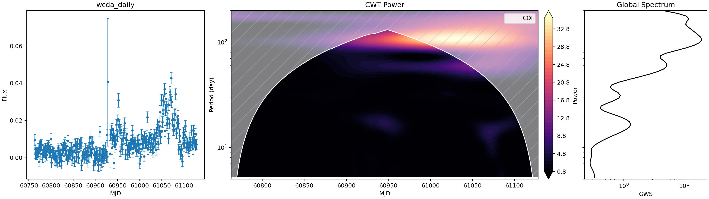
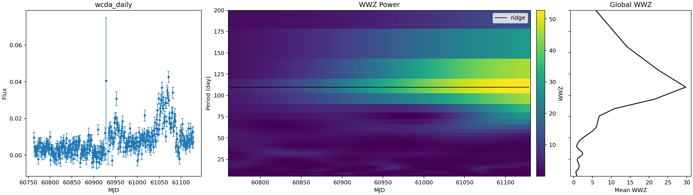
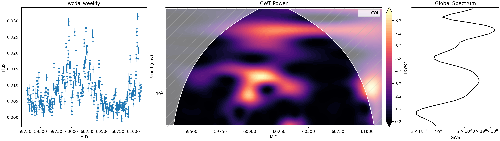
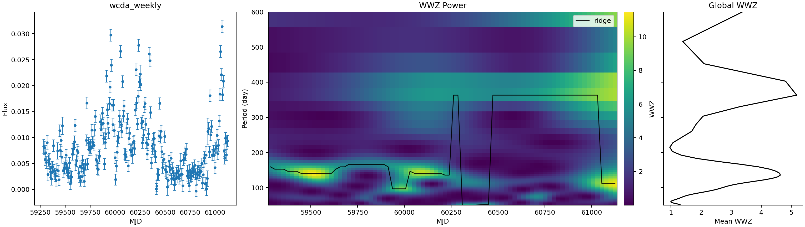
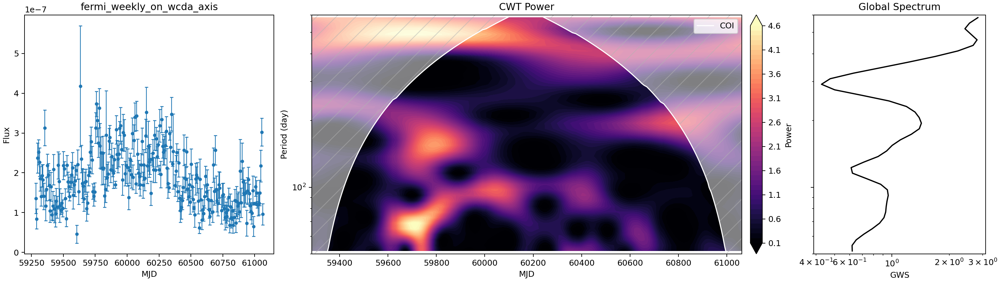
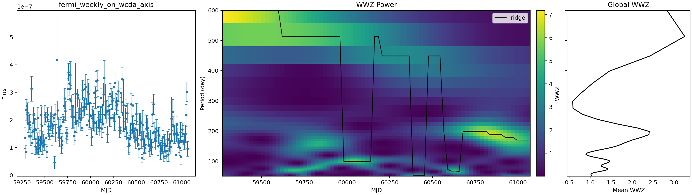

# Mrk 421 WCDA/Fermi Periodicity Analysis v1

Generated from local pipeline outputs in `data/processed/periodicity/`. Current report date: 2026-05-13.

## Scope

This first version aligns LHAASO-WCDA and Fermi weekly light curves on the LHAASO time axis, runs CWT and WWZ periodicity checks, and intentionally skips simulation-based significance testing. Fermi daily analysis is deferred because no ready Fermi daily light-curve product is currently available in the project or the checked IHEP QPO directory.

## Data Synchronization and Alignment

The WCDA merged products were copied from IHEP into the local processed data area:

- `data/processed/wcda_week/LHAASO-WCDA_Mkn421_2021-03-08_2026-03-29_week.csv`
- `data/processed/wcda_day/LHAASO-WCDA_Mkn421_2025-03-29_2026-03-29_day.csv`

Aligned CSV outputs were written to `data/processed/aligned/`. The Fermi weekly product is mapped onto the WCDA weekly MJD axis with nearest-bin matching; WCDA bins beyond Fermi coverage remain as `NaN`. In the generated aligned Fermi table, 14 of 264 WCDA weekly bins have missing Fermi flux.

## Methods

WCDA flux is represented as an excess rate, `sum(n_on - n_bkg) / tobs`, with a Poisson-style on/off error approximation propagated per hit bin. CWT uses a Morlet wavelet through `pycwt`. WWZ uses `libwwz` with the v1 quick-look grid saved by `src/pipeline/periodicity_v1.py`.

No red-noise simulations, Monte Carlo thresholds, local significance contours, pre-trial significance, or post-trial significance are included in this version.

## Peak Summary

| Series | N | MJD min | MJD max | Median dt [d] | CWT peak [d] | CWT GWS | WWZ peak [d] | WWZ power |
| --- | ---: | ---: | ---: | ---: | ---: | ---: | ---: | ---: |
| WCDA daily | 360 | 60763.167 | 61128.167 | 1.000 | 104.95 | 19.650 | 109.77 | 29.772 |
| WCDA weekly | 264 | 59284.333 | 61125.167 | 7.000 | 367.33 | 4.486 | 363.22 | 5.177 |
| Fermi weekly on WCDA weekly axis | 250 | 59284.333 | 61062.167 | 7.000 | 583.10 | 2.828 | 513.37 | 3.260 |

## Main Results

- **WCDA daily**: CWT global peak near 104.95 d; WWZ mean-power peak near 109.77 d.
- **WCDA weekly**: CWT global peak near 367.33 d; WWZ mean-power peak near 363.22 d.
- **Fermi weekly on WCDA weekly axis**: CWT global peak near 583.10 d; WWZ mean-power peak near 513.37 d.

## Figures

### WCDA daily

*CWT quick-look map and Global Wavelet Spectrum.*

*WWZ time-period map, ridge, and mean WWZ spectrum.*

### WCDA weekly

*CWT quick-look map and Global Wavelet Spectrum.*

*WWZ time-period map, ridge, and mean WWZ spectrum.*

### Fermi weekly on WCDA axis

*CWT quick-look map and Global Wavelet Spectrum.*

*WWZ time-period map, ridge, and mean WWZ spectrum.*

## Outputs

- Aligned CSVs: `data/processed/aligned/`
- CWT/WWZ arrays and plots: `data/processed/periodicity/`
- Pipeline entry point: `python src/pipeline/periodicity_v1.py`
