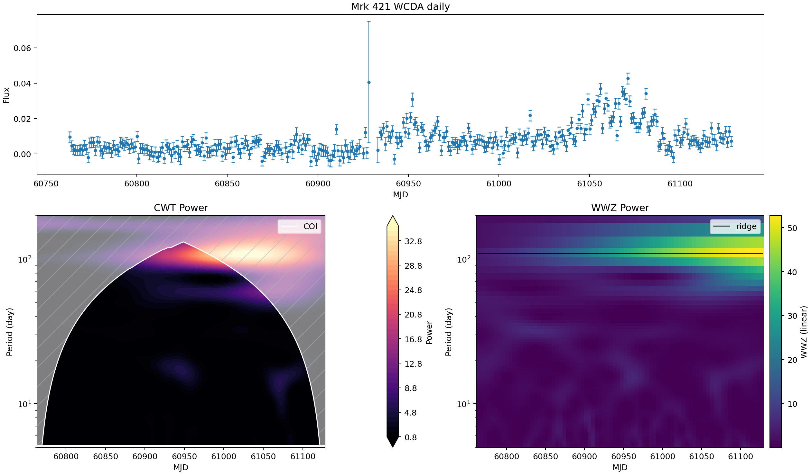
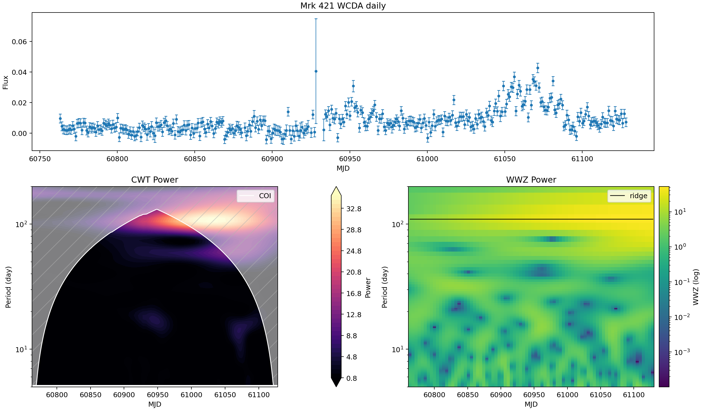
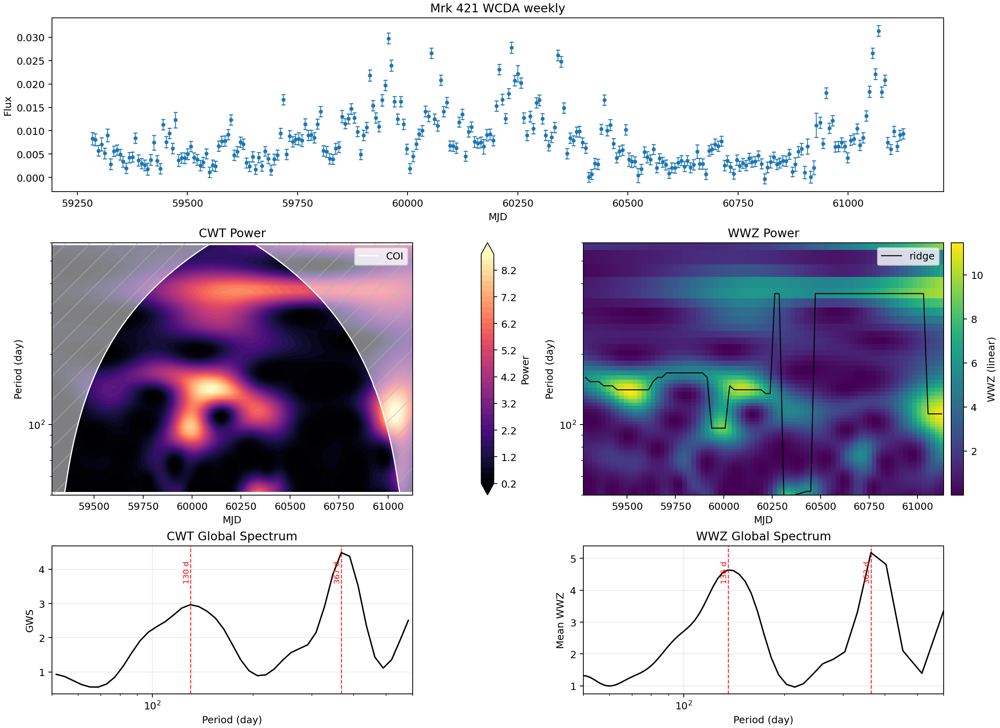
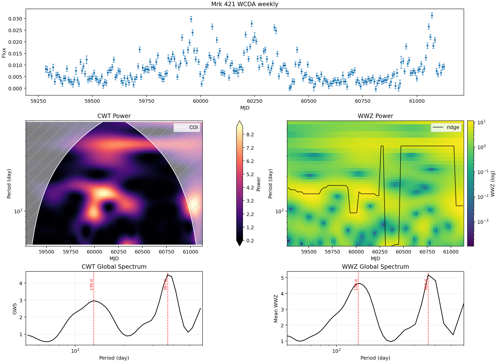
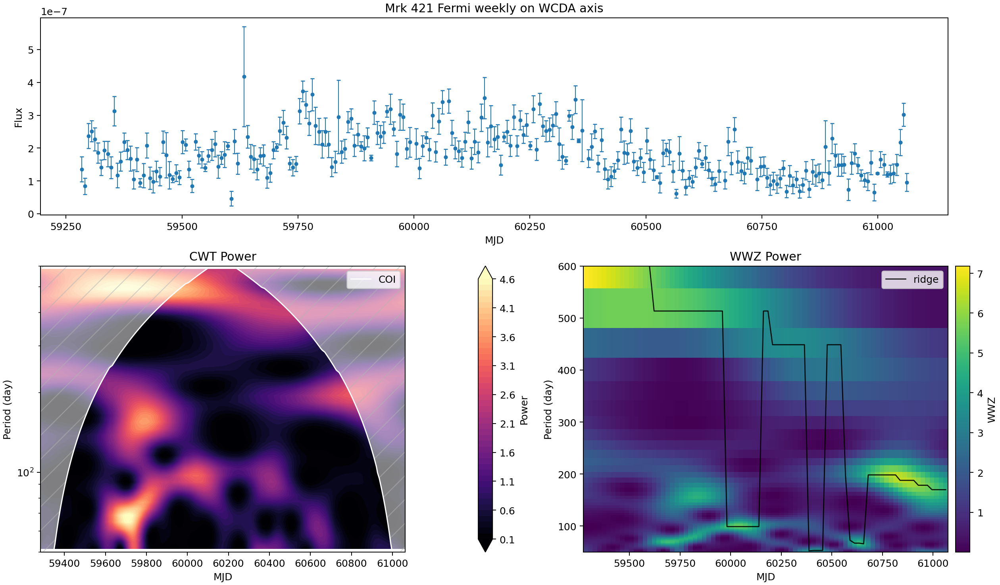
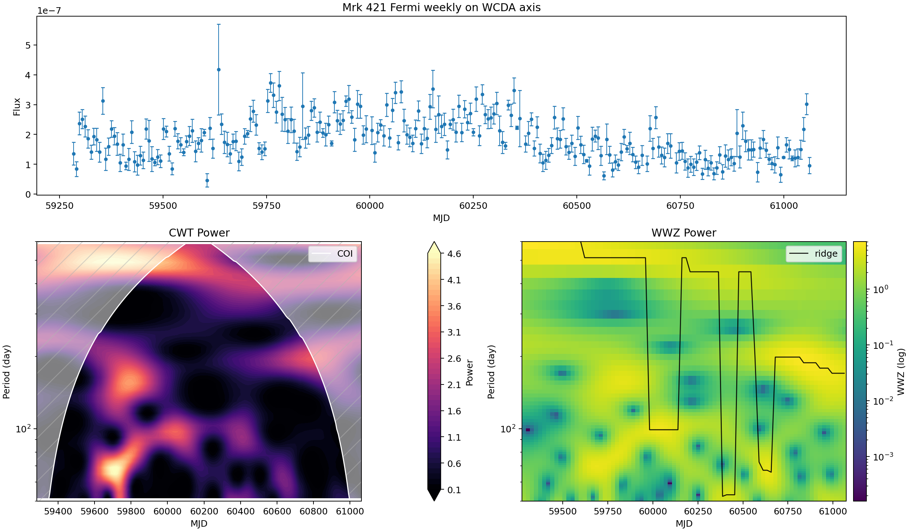
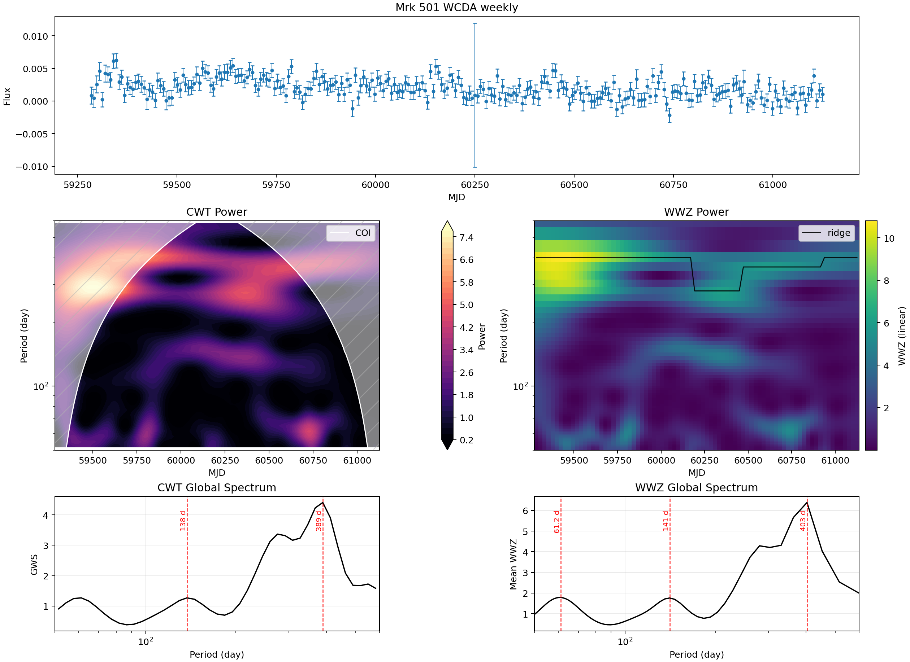
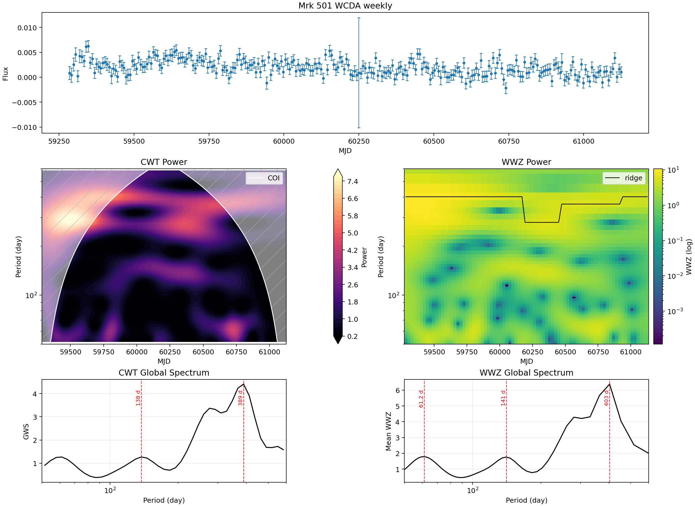

# Mrk 421 / Mrk 501 WCDA Periodicity Analysis v1

Generated from local pipeline outputs in `data/processed/periodicity/{mkn421,mkn501}/`. Current report date: 2026-05-20.

This version keeps the existing Mrk 421 WCDA/Fermi quick-look analysis and adds the newly generated Mrk 501 LHAASO-WCDA weekly light curve. It runs CWT and WWZ checks and intentionally skips simulation-based significance testing.

The updated figures use a clearer layout: the light curve is shown across the first row, while CWT and WWZ maps are separated on the second row. In the regular periodicity section after the xgm poster comparison, WWZ main displays now use linear heatmap color normalization; previous log-color versions are retained as visual references. The period axis remains log-scaled.

## Peak Summary

| Source | Series | N | MJD min | MJD max | Median dt [d] | CWT peak [d] | CWT GWS | WWZ peak [d] | WWZ power |
| --- | --- | ---: | ---: | ---: | ---: | ---: | ---: | ---: | ---: |
| Mrk 421 | WCDA daily | 360 | 60763.167 | 61128.167 | 1.000 | 104.95 | 19.650 | 109.77 | 29.772 |
| Mrk 421 | WCDA weekly | 264 | 59284.333 | 61125.167 | 7.000 | 367.33 | 4.486 | 363.22 | 5.177 |
| Mrk 421 | Fermi weekly on WCDA axis | 250 | 59284.333 | 61062.167 | 7.000 | 583.10 | 2.828 | 513.37 | 3.260 |
| Mrk 501 | WCDA weekly | 264 | 59284.333 | 61125.167 | 7.000 | 389.17 | 4.407 | 402.98 | 6.385 |

## Figure Notes

- Mrk 421 WCDA daily covers 2025-03-29 04:00 UTC to 2026-03-29 04:00 UTC.
- Mrk 421 WCDA daily: CWT peak 104.95 d (GWS 19.650); WWZ peak 109.77 d (power 29.772).
- Mrk 421 WCDA weekly covers 2021-03-11 07:59 UTC to 2026-03-26 04:00 UTC.
- Mrk 421 WCDA weekly: CWT peak 367.33 d (GWS 4.486); WWZ peak 363.22 d (power 5.177).
- Mrk 421 Fermi weekly on WCDA axis covers 2021-03-11 07:59 UTC to 2026-01-22 04:00 UTC.
- Mrk 421 Fermi weekly on WCDA axis: CWT peak 583.10 d (GWS 2.828); WWZ peak 513.37 d (power 3.260).
- Mrk 501 WCDA weekly covers 2021-03-11 07:59 UTC to 2026-03-26 04:00 UTC.
- Mrk 501 WCDA weekly: CWT peak 389.17 d (GWS 4.407); WWZ peak 402.98 d (power 6.385).

No red-noise simulations, Monte Carlo thresholds, local significance contours, pre-trial significance, or post-trial significance are included in this version.

## Regular WWZ Color-Scale Comparison

Main regular figures now use linear WWZ heatmap color normalization. The Mrk 421 and Mrk 501 WCDA weekly summary figures additionally show CWT and WWZ global spectra below the 2D maps. Red dashed lines mark algorithmic candidate peaks in those global spectra; they are not significance-vetted detections.

Log-color reference kept for comparison:

Log-color reference kept for comparison:

Log-color reference kept for comparison:

Log-color reference kept for comparison:

## xgm poster 复现检查

Input file: `data/processed/wcda_day/LHAASO-WCDA_Mkn421_2023-06-25_2026-03-29_day.csv`.

This comparison uses `excess_counts = sum(n_on - n_bkg)` as a photon-count flux proxy. It is not a calibrated physical flux, and it is not guaranteed to be the exact same flux definition used in the xgm poster. WWZ is computed with the project helper in `src/methods/periodicity.py`; 95%/99% significance curves, red-noise simulations, and trial corrections are not reproduced in this pass.

| Window | xgm poster reported | My reproduction | Reading |
| --- | --- | --- | --- |
| 60200-60700 | 51.05 d | Global WWZ peak 111.01 d; nearest 51.05 d grid point is 49.93 d, power 12.330, rank 3 | 50 d is a strong local feature, but not the dominant peak in this run |
| 61020-61098 | 2.54, 5.2, 16.6 d | Global peak at 50.00 d upper boundary; 16.96 d ranks 3, 5.12 d ranks 10, 2.52 d is not prominent | 16.6 d has a visible counterpart; the shorter candidates are weaker here |

Interpretation: this is a comparison between the xgm poster labels and my current reproduction using the available daily `excess_counts` series. The 50 d feature appears locally in the 60200-60700 window, but my global WWZ peak is at longer periods. The short-window page shows the clearest counterpart near 16.6 d, while 2.54 d and 5.2 d are weaker in this run.
