# Mrk 421 / Mrk 501 WCDA Flux Periodicity Analysis v2

Generated on 2026-06-03 from strict-batch WCDA flux products.

This v2 report replaces the v1 WCDA photon-count/excess-rate proxy with the strict-batch forward-folded `N0` flux normalization at `E0=3 TeV` with fixed `gamma=2.6`. The Fermi comparison is realigned to the v2 WCDA weekly flux axis.

**Significance scope.** The main v2 CWT/WWZ maps and global spectra remain quick-look periodicity products only. The user-requested xgm MJD 60200-60700 CWT/WWZ targets are assessed with AR(1) surrogates in this pass; no source/method/window-search/post-trial correction is applied.

## Peak Summary

| Source | Series | N | MJD min | MJD max | dt [d] | CWT peak [d] | WWZ peak [d] |
| --- | --- | ---: | ---: | ---: | ---: | ---: | ---: |
| Mrk 421 | WCDA daily N0 flux | 1570 | 59281.500 | 60887.500 | 1.000 | 132.23 | 128.17 |
| Mrk 421 | WCDA weekly N0 flux | 229 | 59284.500 | 60880.500 | 7.000 | 367.33 | 131.25 |
| Mrk 421 | Fermi weekly on WCDA flux axis | 224 | 59284.500 | 60880.500 | 7.000 | 583.10 | 600.00 |
| Mrk 501 | WCDA daily N0 flux | 1560 | 59282.500 | 60887.500 | 1.000 | 157.25 | 152.49 |
| Mrk 501 | WCDA weekly N0 flux | 229 | 59284.500 | 60880.500 | 7.000 | 462.80 | 436.07 |

## Coverage Notes

- WCDA daily flux products currently cover 2021-03-08 to 2025-07-31.
- WCDA weekly flux products currently cover 2021-03-08 to 2025-07-27.
- This is shorter than the v1 counts/proxy products, so v2 does not reproduce late-2025/2026 WCDA-only sections.
- WCDA v2 aligned products apply an uncertainty-outlier QC filter after the `fit_status=OK` strict-flux filter: rows with `N0_err > 5 x median(N0_err)` are excluded per source/cadence, and rejected rows are saved beside each aligned CSV.

## WCDA Flux QC Summary

| Source | Cadence | OK rows | Kept | Rejected | N0_err limit |
| --- | --- | ---: | ---: | ---: | ---: |
| Mkn421 | day | 1588 | 1570 | 18 | 8.206e-13 |
| Mkn421 | week | 229 | 229 | 0 | 3.142e-13 |
| Mkn501 | day | 1591 | 1560 | 31 | 6.963e-13 |
| Mkn501 | week | 229 | 229 | 0 | 2.571e-13 |

## Main Figures

### Mrk 421 WCDA daily flux

- N=1570; MJD 59281.500-60887.500; median dt=1.000 d.
- CWT peak=132.23 d; WWZ peak=128.17 d.
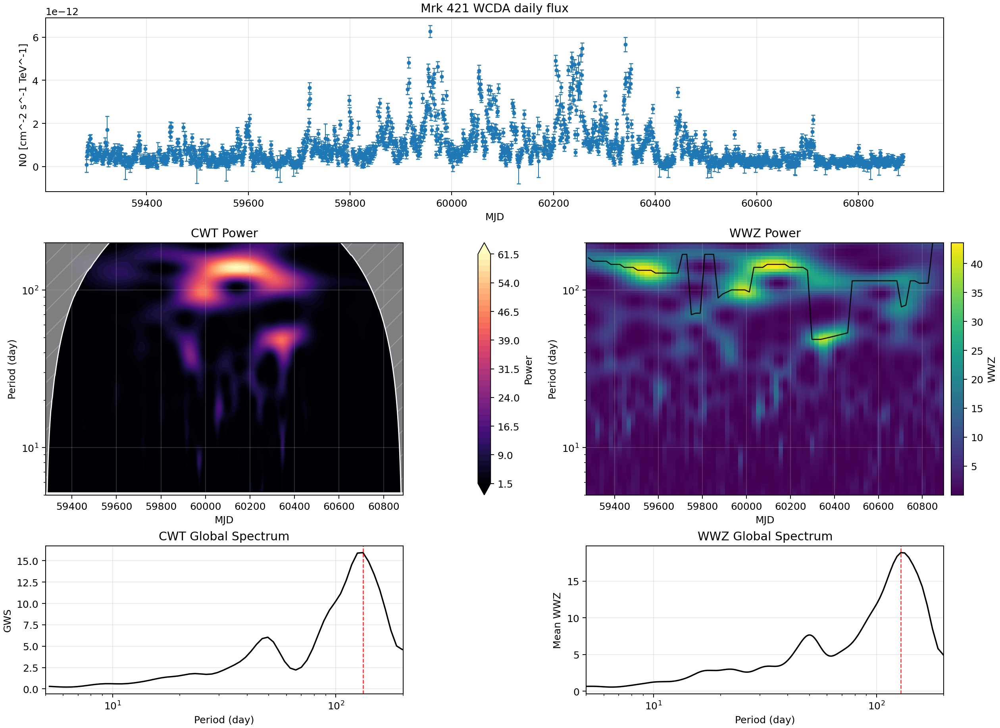

### Mrk 421 WCDA weekly flux

- N=229; MJD 59284.500-60880.500; median dt=7.000 d.
- CWT peak=367.33 d; WWZ peak=131.25 d.
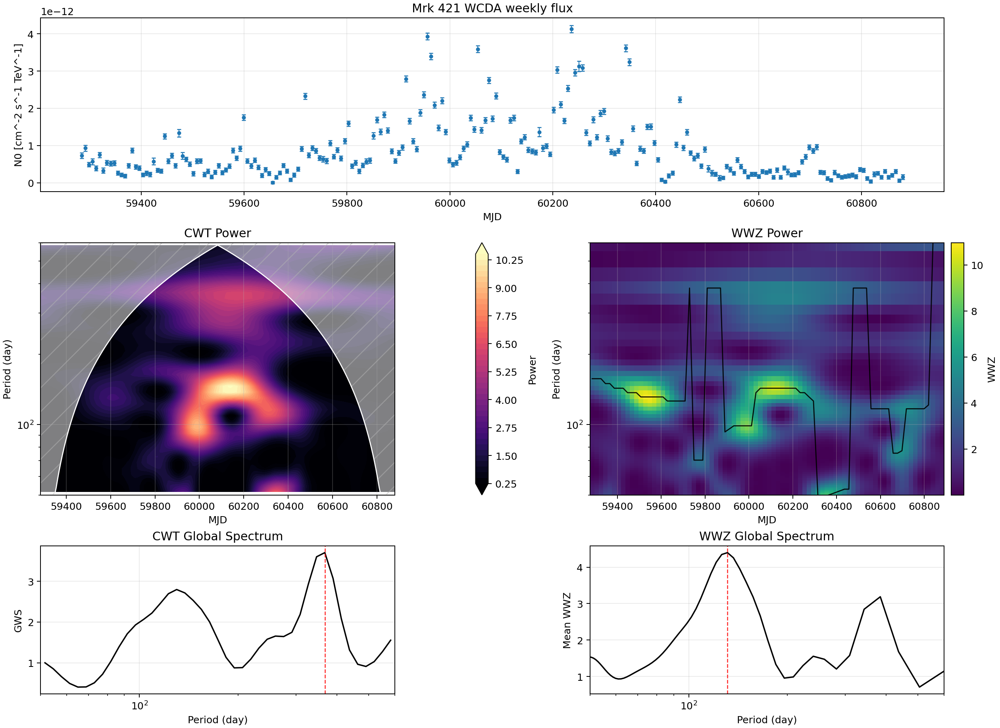

### Mrk 421 Fermi weekly on WCDA flux axis

- N=224; MJD 59284.500-60880.500; median dt=7.000 d.
- CWT peak=583.10 d; WWZ peak=600.00 d.
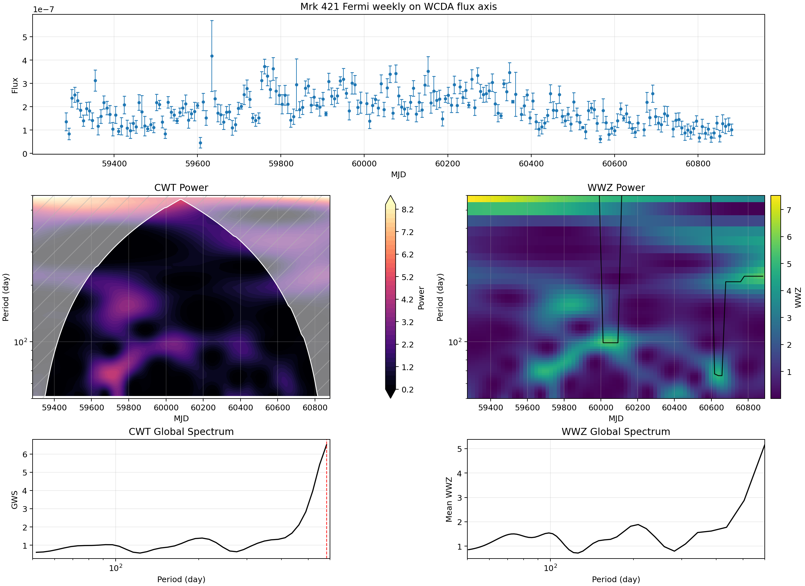

### Mrk 501 WCDA daily flux

- N=1560; MJD 59282.500-60887.500; median dt=1.000 d.
- CWT peak=157.25 d; WWZ peak=152.49 d.
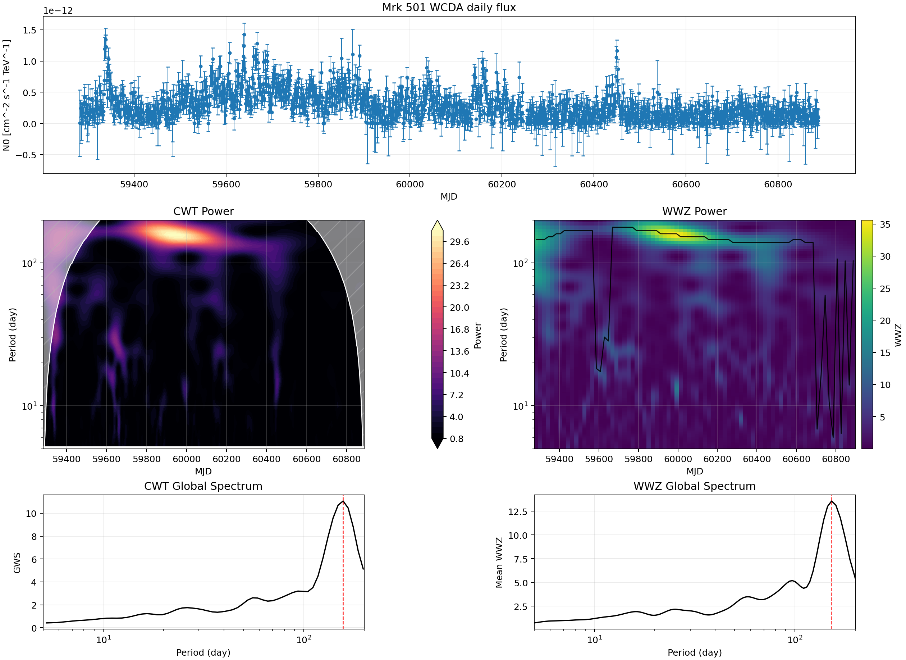

### Mrk 501 WCDA weekly flux

- N=229; MJD 59284.500-60880.500; median dt=7.000 d.
- CWT peak=462.80 d; WWZ peak=436.07 d.
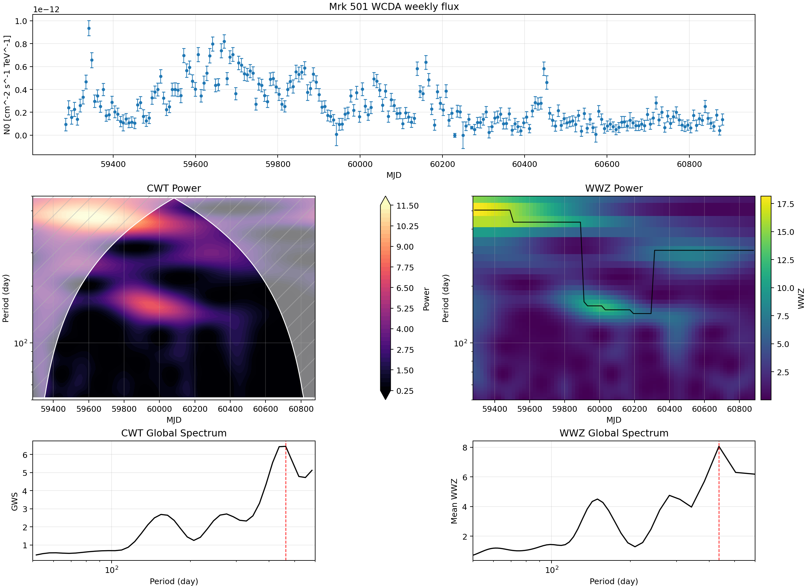

## Mrk 421 Fixed Window, MJD 59500-60500

This v2 fixed-window check uses weekly `N0` flux and keeps the v1 140 d target-band localization, but does not run surrogate significance.

| Method | Period [d] | Cycles | Observed power | Significance |
| --- | ---: | ---: | ---: | --- |
| CWT strongest | 137.59 | 7.22 | 3.669 | deferred |
| WWZ strongest | 138.89 | 7.16 | 4.776 | deferred |
| CWT targeted 140 d band | 137.59 | 7.22 | 3.669 | deferred |
| WWZ targeted 140 d band | 138.89 | 7.16 | 4.776 | deferred |

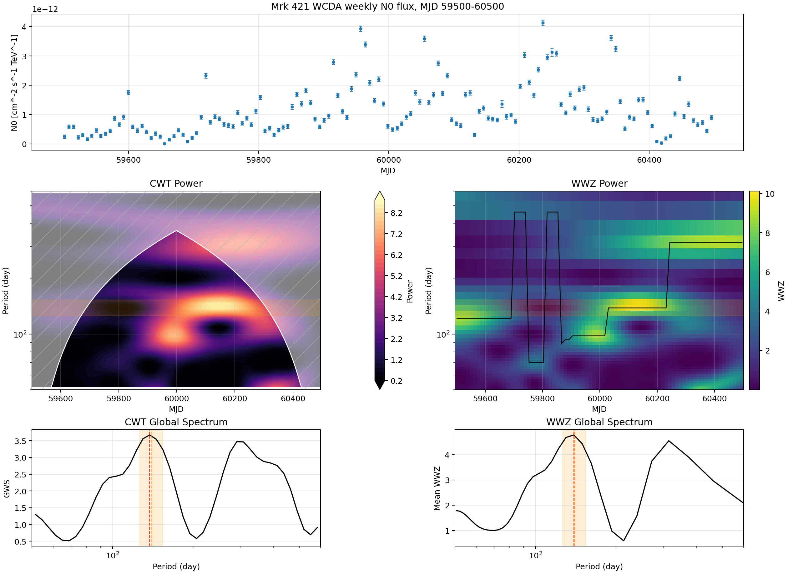

## xgm Poster Flux Quick-Look

Only MJD 60200-60700 is rerun with daily `N0` flux. The v1 MJD 61020-61098 poster window is outside the current strict-batch flux coverage and is marked pending.

### xgm Poster Comparison Note

This is not an apples-to-apples comparison with xgm poster page 5: the poster panel uses WCDA counts and a PSD reference-curve display, whereas v2 uses strict-batch daily `N0` flux and reports AR(1) surrogate local/global FAP on the same sampling. The poster's visual >99% reading is therefore not equivalent to a v2 flux >99% claim.

| Case | Input | Method | N | alpha | Local peak [d] | Power | Local FAP | Global FAP | 99% |
| --- | --- | --- | ---: | ---: | ---: | ---: | ---: | ---: | --- |
| xgm poster page 5 | WCDA counts | WWZ/PSD visual reference | - | - | - | - | - | - | claimed on poster |
| local v1 counts/proxy reproduction | excess counts proxy | WWZ AR(1) local-window | 493 | 0.722 | 49.92 | 12.330 | 0.0619 | - | no |
| v2 strict-flux WWZ | daily N0 flux | WWZ AR(1) local/global | 491 | 0.828 | 49.92 | 16.697 | 0.1009 | 0.7463 | no |
| v2 strict-flux CWT | daily N0 flux | CWT AR(1) local/global | 491 | 0.828 | 49.53 | 9.781 | 0.3317 | 0.9540 | no |

| Target | Period [d] | WWZ power | Cycles | Significance |
| --- | ---: | ---: | ---: | --- |
| v2 flux global peak | 111.01 | 17.175 | 4.50 | see targeted AR(1) below |
| xgm poster reference 51.05 d nearest grid | 49.92 | 16.697 | 10.00 | see targeted AR(1) below |

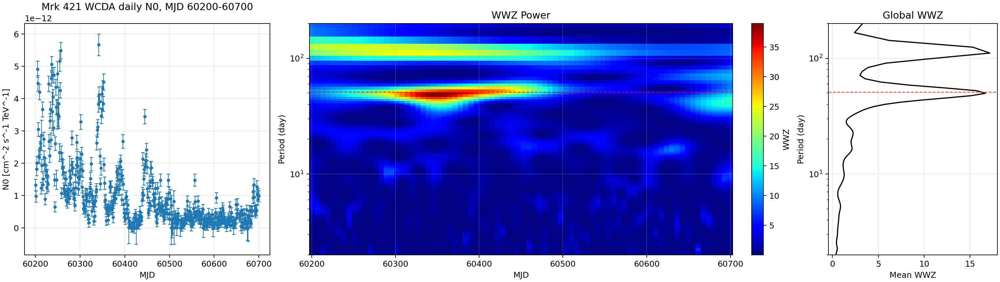

Show previous counts/proxy version

These are the v1 counts/proxy products for the same MJD 60200-60700 window. They are included only for input/method comparison and are not v2 strict-flux results.

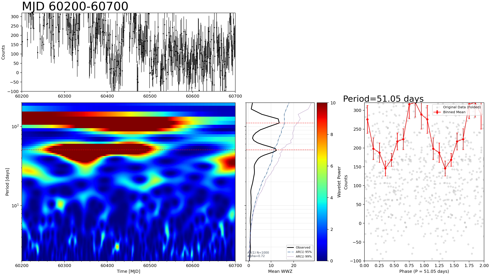

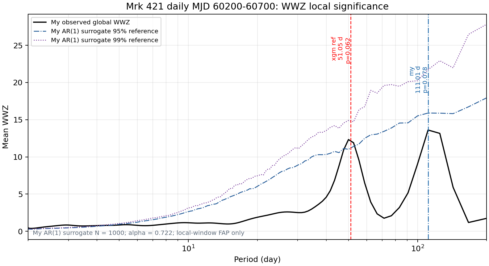

### xgm Window WWZ Significance

AR(1) Gaussian surrogates use the same v2 daily flux sampling. Local FAP tests the maximum global WWZ inside target period ±10%; global FAP references the maximum across the same 2-200 d search range. No source/method/window-search/post-trial correction is included.

| Target | Target period [d] | Local peak [d] | WWZ | Local FAP | Global FAP | Above 99% | Nsim |
| --- | ---: | ---: | ---: | ---: | ---: | --- | ---: |
| v2 flux global peak | 111.01 | 111.01 | 17.175 | 0.1728 | 0.7233 | no | 1000 |
| xgm poster reference 51.05 d | 51.05 | 49.92 | 16.697 | 0.1009 | 0.7463 | no | 1000 |

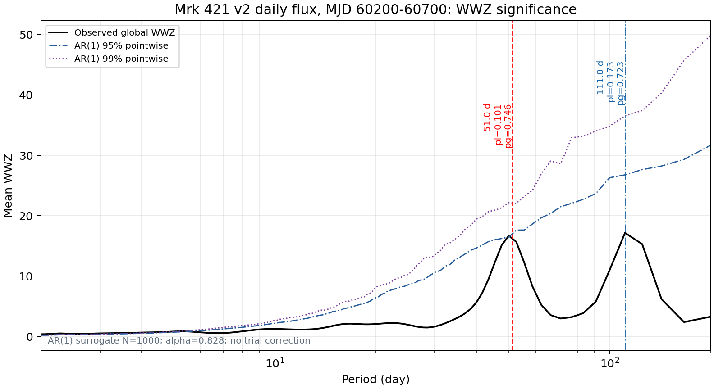

### xgm Window CWT Quick-Look

| Target | Period [d] | CWT power | Cycles | Significance |
| --- | ---: | ---: | ---: | --- |
| v2 flux CWT global peak | 124.81 | 15.424 | 4.00 | see CWT AR(1) below |
| xgm poster reference 51.05 d nearest grid | 52.48 | 8.829 | 9.51 | see CWT AR(1) below |

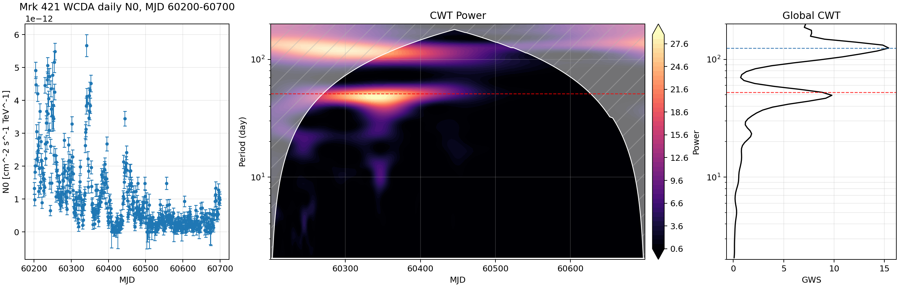

### xgm Window CWT Significance

CWT uses AR(1) Gaussian surrogates on the same v2 daily flux sampling. Local FAP tests the maximum global CWT inside target period ±10%; global FAP references the maximum across the same 2-200 d search range. No source/method/window-search/post-trial correction is included.

| Target | Target period [d] | Local peak [d] | CWT | Local FAP | Global FAP | Above 99% | Nsim |
| --- | ---: | ---: | ---: | ---: | ---: | --- | ---: |
| v2 flux CWT global peak | 124.81 | 124.81 | 15.424 | 0.2148 | 0.6394 | no | 1000 |
| xgm poster reference 51.05 d | 51.05 | 49.53 | 9.781 | 0.3317 | 0.9540 | no | 1000 |

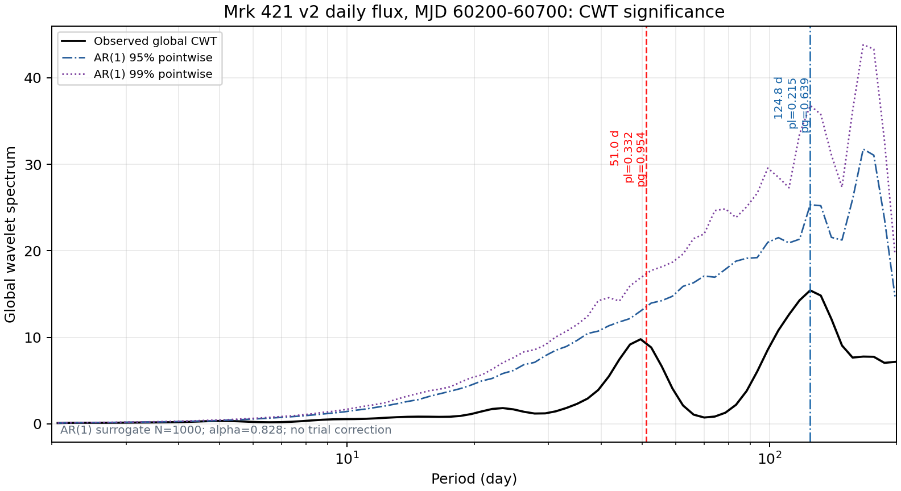

## TELAMON-LHAASO Flux Alignment

The TELAMON overlap with v2 WCDA weekly flux covers MJD 59580.000-60880.500. This figure is visual timing context only; no DCF, correlation, lag, FAP, or QPO significance is reported.

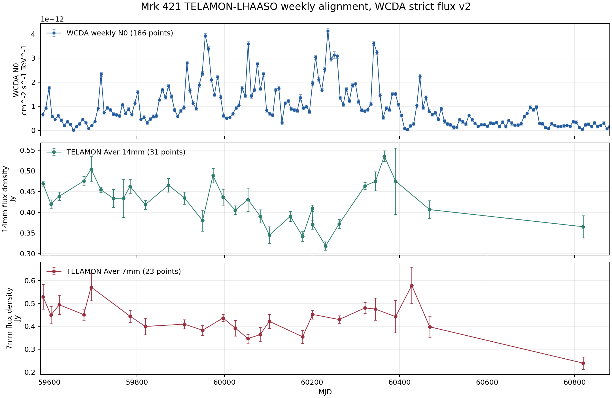
